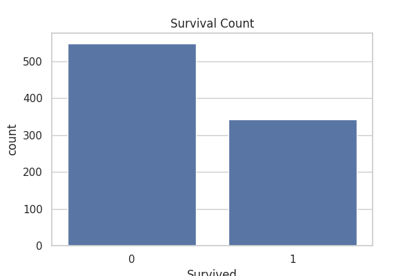
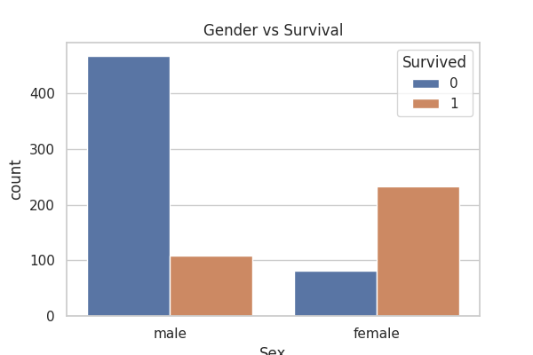
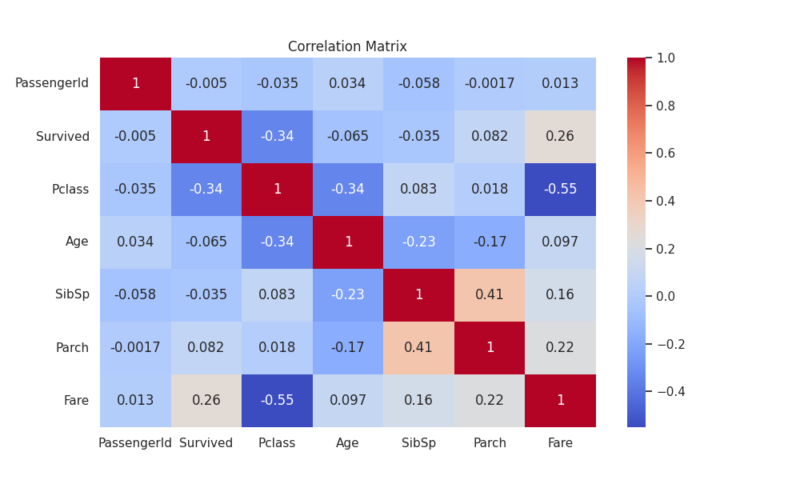

# 🚢 Titanic EDA Project

## 📌 Objective
To perform Exploratory Data Analysis (EDA) on the Titanic dataset and understand the factors affecting passenger survival.

---

## 🛠 Tools Used
- Python
- Pandas
- Matplotlib
- Seaborn

---

## 📊 Steps Performed
- Loaded the dataset
- Checked data types and missing values
- Cleaned the data (handled missing values)
- Created visualizations (histograms, boxplots, countplots)
- Performed correlation analysis
- Generated insights

---

## 📈 Key Visualizations

### Survival Count

### Gender vs Survival

### Correlation Heatmap

---

## 🔍 Key Insights
- Females had a higher survival rate than males  
- First class passengers survived more than others  
- Higher fare passengers had better survival chances  
- Age distribution is slightly skewed  

---

## 📂 Project Files
- `Titanic_EDA.ipynb` → Main analysis notebook  
- `survival.png`, `gender.png`, `heatmap.png` → Visualizations  

---

## 🚀 Conclusion
EDA helped in understanding the dataset and identifying important patterns that influence survival, which can be useful for further machine learning tasks.
